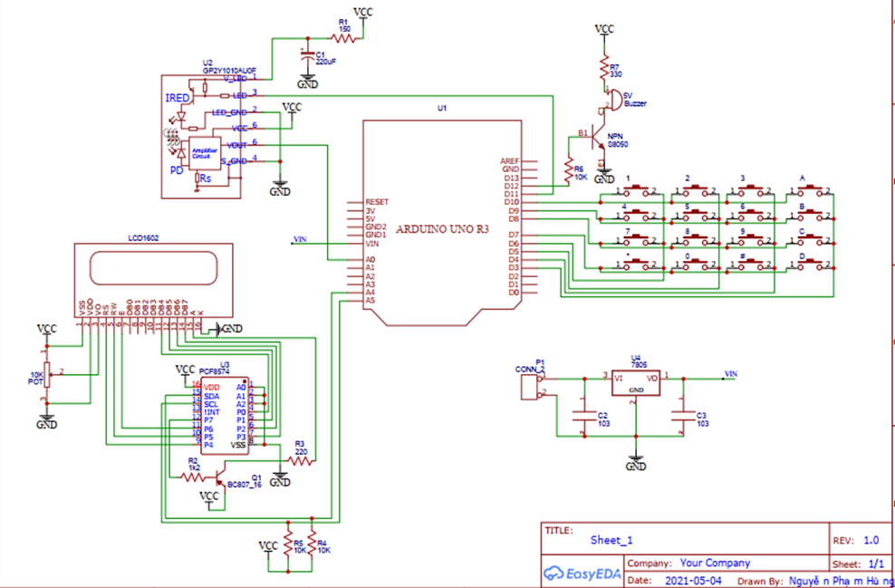
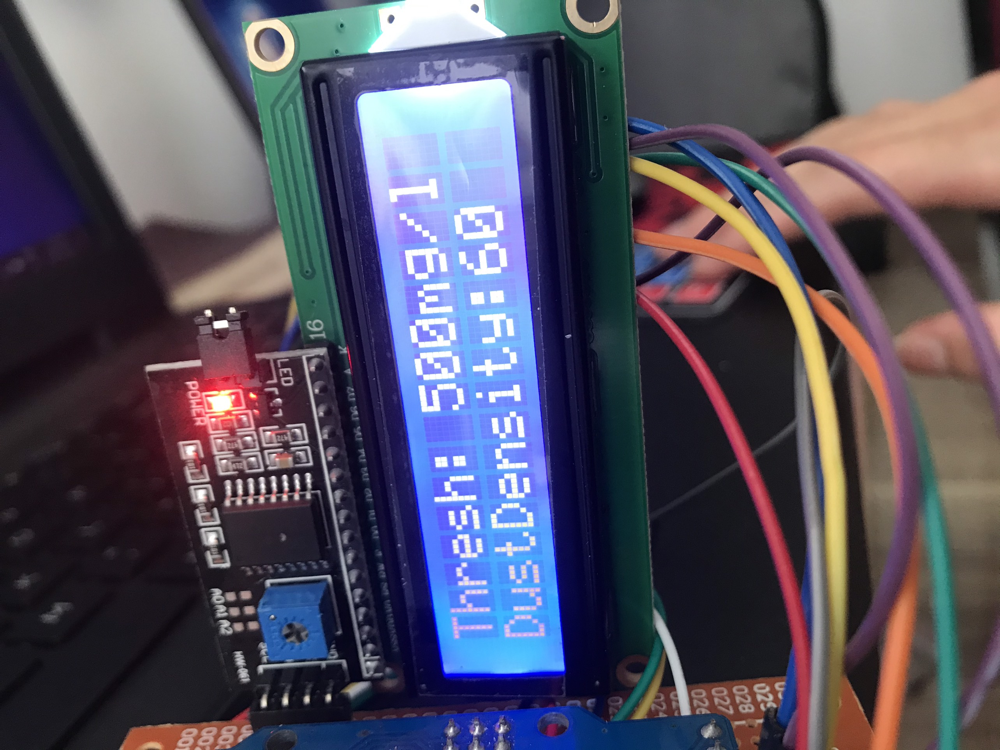
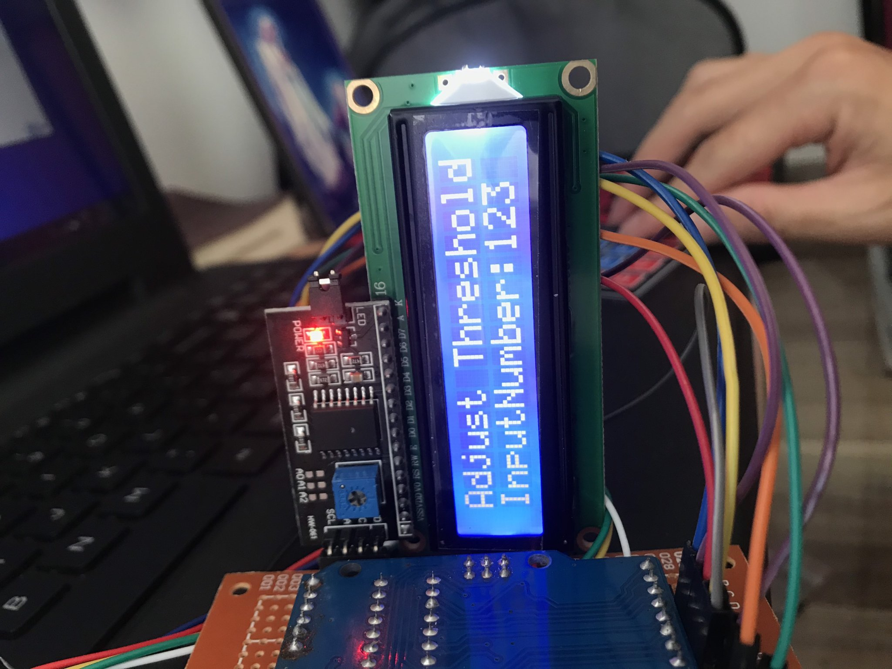
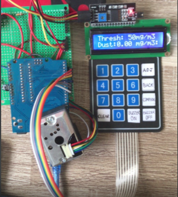

<!-- PROJECT LOGO -->
<br />
<p align="center">
  <h1 align="center">Dust Density</h1>
  
  

<!-- TABLE OF CONTENTS -->
<details open="open">
  <summary>Table of Contents</summary>
  <ol>
    <li>
      <a href="#about-the-project">About The Project</a>
      <ul>
        <li><a href="#overview">Overview</a></li>
		<li><a href="#expected-behavior">Expected Behavior</a></li>
		<li><a href="#project-structure">Project Structure</a></li>
      </ul>
    </li>
	<li><a href="#comments">Comments</a></li>
    <li><a href="#contact">Contact</a></li>
    <li><a href="#references">References</a></li>
  </ol>
</details>


<!-- ABOUT THE PROJECT -->
## About The Project

### Overview
Components used:
* Arduino Uno R3<br>
* LCD 16x02<br>
* Keypad 4x4 <br>
* Dust sensor GP2Y1010AU0F<br>
* Buzzer 5V <br>
### Expected Behavior
<p>
The schematic diagram of the circuit is built by EasyEDA tool.
<p align="center">
  
</p>
Some images of the operation of the project:
<p align="center">
  
  
  
</p>


### Project Structure

```
├── README.md              	: Description of project
├── images              	: Folder contains images of project
      ├── dust1.jpg
      ├── dust2.jpg
      ├── dust3.png
      ├── schematic.png
├── GP2Y1010AU0F.cpp		
├── GP2Y1010AU0F.h		: Sensor library
├── TKHTN.ino         		: Run on Arduino IDE

```

<!-- GETTING STARTED -->
## Comments

<!-- CONTACT -->
## Contact

Author - [PHAM NGUYEN QUOC HUNG](https://hun9pham.github.io) - hungpham99er@gmail.com

Project Link: [Souce code](https://github.com/hun9pham/chat-application-csharp-winform.git)

## References
[Dust sensor datashet](https://pdf1.alldatasheet.com/datasheet-pdf/view/412700/SHARP/GP2Y1010AU0F.html)
